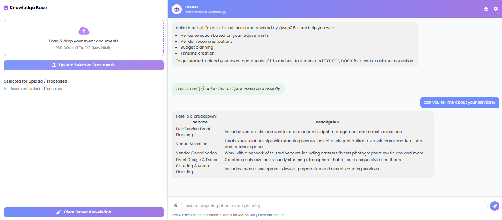

# Project Title: Event Planning Chatbot with RAG-Enhanced Chatbot AGENT (Prototype)

---

## Team Information

| Member Email            | Member Name             | Data Science | Artificial Intelligence |
| :---------------------- | :---------------------- | :----------: | :---------------------: |
| 2234913@slu.edu.ph      | Virgel William Afaga    |      ✅      |           ✅            |
| 2227226@slu.edu.ph      | Xymond Louisse Alcazar  |      ❌      |           ✅            |
| 2211939@slu.edu.ph      | Rebelais Mar Bernabe    |      ✅      |           ❌            |
| 2215424@slu.edu.ph      | Alastair Zeph De Guzman |      ❌      |           ✅            |
| 2230729@slu.edu.ph      | Freddie Dongsino        |      ❌      |           ✅            |
| 2233360@slu.edu.ph      | Ramil Panlilio Grabador |      ❌      |           ✅            |
| 2235775@slu.edu.ph      | Trevor Khushrenada      |      ❌      |           ✅            |
| 2195465@slu.edu.ph      | Rafael Lachica          |      ✅      |           ❌            |
| 2235774@slu.edu.ph      | Anthony Llena           |      ✅      |           ✅            |
| 2223041@slu.edu.ph      | Ian Bennedick Retuta    |      ✅      |           ✅            |
| 2214959@slu.edu.ph      | Ka-Hang Christian Yuen  |      ✅      |           ❌            |

---

## Project Overview

**Plug and Play**: Chatbot Model for Event Planning & Management Small to Medium Enterprises, utilizing a Retrieval-Augmented Generation (RAG) Pipeline for external knowledge injection.

**GitLab Repository**: [https://gitlab.com/2195465/ai-model/-/tree/f875bef905d5304b3a743ab422f11f4ae5403435/](https://gitlab.com/2195465/ai-model/-/tree/f875bef905d5304b3a743ab422f11f4ae5403435/)

---

## Research Paper Link
**Published Paper at ATIFTAP Conference**: [Published Paper Link](https://static1.squarespace.com/static/5b85162bcc8fedc767ff5676/t/692a9a8a1c753c57a56c6974/1764399754599/JGB+19338+.pdf)
**Data Science & AI Collaboration Paper**: [Google Docs Link](https://docs.google.com/document/d/1a-1uPP00MpgHOdbdkgsLs-jIF1fq0K1_aQk4ueAFaqg/edit?usp=sharing)

---

## Official Google Drive

- **Dataset Drive**: [Link](https://drive.google.com/drive/folders/1SM8pnriJ7r4ac412nZDJyK5TKcqRUEme?usp=sharing)  
- **Finetuned Models Drive**: [Link](https://drive.google.com/drive/folders/1-L9-MDda1zwYfDMfdtXZuVn2wsyYLGrw?usp=sharing)

---

## Setup Instructions

### 1. Clone the Repository

```bash
git clone https://gitlab.com/2195465/ai-model.git
cd ai-model
```

> You can also clone using the specific commit reference:
> ```bash
> git checkout f875bef905d5304b3a743ab422f11f4ae5403435
> ```

---

### 2. Create and Activate a Virtual Environment

```bash
python -m venv venv
source venv/bin/activate  # On Windows: venv\Scripts\activate
```

If Permission error occurred use this command for a quick fix

```bash
Set-ExecutionPolicy -ExecutionPolicy RemoteSigned -Scope CurrentUser
```

---

### 3. Install Python Dependencies

```bash
pip install -r requirements.txt
```

If `requirements.txt` is not available, you can manually install common packages:

```bash
pip install flask transformers torch sentence-transformers langchain
```

---

### 4. Upload Model Files

1. Download your **finetuned model files** from the [Finetuned Models Drive](https://drive.google.com/drive/folders/1-L9-MDda1zwYfDMfdtXZuVn2wsyYLGrw?usp=sharing).
2. Create a `models` directory in the root of the project if it doesn’t exist:

   ```bash
   mkdir models
   ```

3. Place the **entire downloaded model folder** inside the `models/` directory. Your structure should look like this:

   ```
   ai-model/
   ├── app.py
   ├── models/
   │   └── your_model_directory/
   │       ├── config.json
   │       ├── pytorch_model.bin
   │       └── tokenizer/
   └── ...
   ```

4. Make sure your code refers correctly to the model path (e.g., `models/your_model_directory`).

---

### 5. Run the Application

```bash
python app.py
```

Open your browser and navigate to `http://localhost:5000` to access the chatbot interface.

---

## Preview


